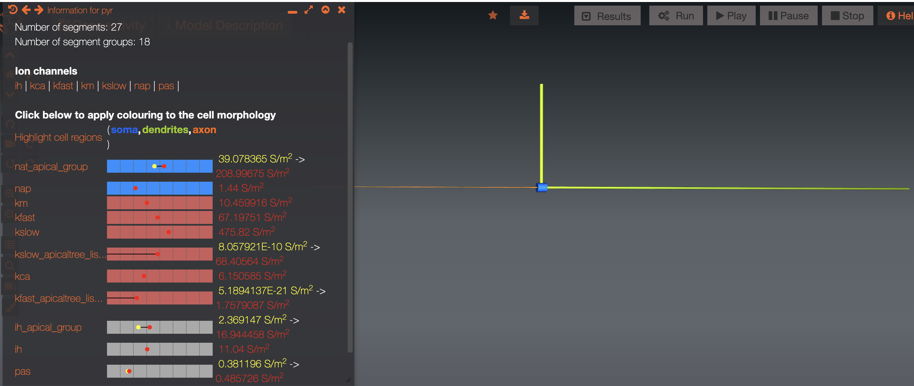

# Google Summer of Code 2022


## General Information:
- Mentors:
    - [Padraig Gleeson](https://github.com/pgleeson)
    - [Ankur Sinha](https://github.com/sanjayankur31)
- Contributor: [Shayan Shafquat](https://github.com/shayan823)
- General links:
    - [NeuroML documentation](https://docs.neuroml.org) 
    - [Open Source Brain documentation](https://docs.opensourcebrain.org)
    - [OSBv1](https://opensourcebrain.org)
    - [OSBv2](https://v2.opensourcebrain.org)
- Main Repository: [BahlEtAl2012_ReducedL5PyrCell](https://github.com/OpenSourceBrain/BahlEtAl2012_ReducedL5PyrCell)

## Contributions:
- [Pulled request opened during GSoC](https://github.com/OpenSourceBrain/BahlEtAl2012_ReducedL5PyrCell/pulls?q=is%3Apr+author%3Ashayan823)
- [Issues opened during GSoC](https://github.com/OpenSourceBrain/BahlEtAl2012_ReducedL5PyrCell/issues?q=is%3Aissue+author%3Ashayan823)
- [Commit history](https://github.com/OpenSourceBrain/BahlEtAl2012_ReducedL5PyrCell/commits?author=shayan823)

## Community bonding period
The community bonding period was mainly for getting to know more about the other cortical pyramidal cell models on OSB which have been converted to NeuroML. They had same or similar mod files which eased the conversion of those used in this model. Moving forward I started with writing a python script for the single compartmental cell i.e. soma with all the density mechanisms and was able to successfully run a simulation on it. Other than that, in this period I was involved with running simulations on NEURON. Since I was not much accustomed to the NEURON GUI tools I went through some of the NEURON tutorial videos and also got myself added to their discussion group.

## Coding period
### Week 1 - 4
- Created the [Test_soma.hoc](https://github.com/OpenSourceBrain/BahlEtAl2012_ReducedL5PyrCell/blob/master/NEURON/channels/Test_soma.hoc) file to test the neuroml single compartmental (soma) cell 
    - Added [plots](https://github.com/OpenSourceBrain/BahlEtAl2012_ReducedL5PyrCell/blob/70ab1e87dda5fd983c6c47a2af87027f647952b4/NEURON/channels/Test_soma.hoc#L101) of the activation / inactivation variables for all the channels 
- Added the summary plots of the channels converted to neuroml to a directory
    - Density mechanisms in neuroml are first validated using ```pyneuroml -validate```
    - Summary plots include time course and steady state of the different gates. Link to the [directory](https://github.com/OpenSourceBrain/BahlEtAl2012_ReducedL5PyrCell/tree/nrn_tests/NeuroML2/channel_summary)
    - Faced issue to plot for kslow channel (fractional gate) using pynml-channelanalysis. Hence, created a [LEMS file for kslow channel](https://github.com/OpenSourceBrain/BahlEtAl2012_ReducedL5PyrCell/blob/nrn_tests/NeuroML2/LEMS_Test_kslow.xml) to get the simulation saved in dat files
    - Upgraded the [channel info template](https://github.com/NeuroML/pyNeuroML/blob/development/pyneuroml/analysis/ChannelInfo_TEMPLATE.md) to a different style with no text flowing inside. Link to the [merged PR](https://github.com/NeuroML/pyNeuroML/pull/174) 
- Comparison of LEMS and mod files for all the channels
    - [compare_nml2_mods.py](compare_nml2_mods.py) - Updates the readme, comparing steady state and time course plots of each channel gates for LEMS and mod files inside the [directory](https://github.com/OpenSourceBrain/BahlEtAl2012_ReducedL5PyrCell/tree/nrn_tests/NeuroML2/compare_nml2_mods) 
- NeuroML implementation of the single compartmental cell (soma) adding each channel one by one
    - Understand the change on activation / inactivation variables (gates) with variable pulse inputs
    - [Inferential](https://neuronaldynamics.epfl.ch/online/Ch2.S3.html) study of the characteristics of the channels involved 
    - Created [mep file](https://github.com/OpenSourceBrain/BahlEtAl2012_ReducedL5PyrCell/blob/master/NEURON/test/.test.mep) and added OMV tests for the LEMS and NEURON files in their respective directories.

Some of my commits in these weeks can be found linked to this [issue.](https://github.com/OpenSourceBrain/BahlEtAl2012_ReducedL5PyrCell/issues/12)
### Week 5 - 8
- Converted the ca dependent mechanisms namely (cad, sca, kca) to NeuroML
    - Understood the dynamics from their mod files and referenced some of the previous works that involved conversion of such mechanisms
    - Compared the LEMS and mod file for sca channel and added the plots to the [compare_nml2_mods](https://github.com/OpenSourceBrain/BahlEtAl2012_ReducedL5PyrCell/tree/master/NeuroML2/compare_nml2_mods) directory
- Tested the ca dependent channels on single compartmental cell
    - Created a [Test_ca_soma.hoc](https://github.com/OpenSourceBrain/BahlEtAl2012_ReducedL5PyrCell/blob/master/NEURON/channels/Test_ca_soma.hoc) file including the three mechanisms and a leak channel. [Recorded](https://github.com/OpenSourceBrain/BahlEtAl2012_ReducedL5PyrCell/blob/70ab1e87dda5fd983c6c47a2af87027f647952b4/NEURON/channels/Test_ca_soma.hoc#L97) the cai,(internal ca conc.), cao (outer ca conc.) and ica (ca current)
    - Similarly, created a [pyr_ca_cell.nml](https://github.com/OpenSourceBrain/BahlEtAl2012_ReducedL5PyrCell/blob/master/NeuroML2/test_ca/pyr_ca_cell.nml) with soma including leak, sca and kca as channel densities and adding the cad as intracellular properties. The [notebook](https://github.com/OpenSourceBrain/BahlEtAl2012_ReducedL5PyrCell/blob/master/NeuroML2/test_ca/soma_ca.ipynb) included plots as above.
    - To debug the discrepancies in the plots, set the conductance for sca, kca to 0 then increased conductance of the mechanisms involved one by one and saw how eca and ica changed for both NEURON as well as NeuroML code.
    - ECA (ca reversal potential) used was not being calculated using the nernst / ghk equation instead was fixed at 140.
    - OMV tests were added for LEMS and hoc files which ran on three simulation engines : [jNeuroML](https://github.com/OpenSourceBrain/BahlEtAl2012_ReducedL5PyrCell/blob/master/NeuroML2/test_ca/.test_ca_soma.jnml.omt), [jNeuroML_NEURON](https://github.com/OpenSourceBrain/BahlEtAl2012_ReducedL5PyrCell/blob/master/NeuroML2/test_ca/.test_ca_soma.jnmlnrn.omt), [jNeuroML_NetPyNE](https://github.com/OpenSourceBrain/BahlEtAl2012_ReducedL5PyrCell/blob/master/NeuroML2/test_ca/.test_ca_soma.jnmlnetpyne.omt)
- Created a [Test_example1.hoc](https://github.com/OpenSourceBrain/BahlEtAl2012_ReducedL5PyrCell/blob/master/NEURON/test/Test_example1.hoc) for example 1 which was able to record from 3 different locations of the cell namely Soma, Apical, Tuft. 
- Morphology of the multi compartmental cell 
    - Exported from the test file created above to NeuroML using [export_nml2.py](https://github.com/OpenSourceBrain/BahlEtAl2012_ReducedL5PyrCell/blob/master/NeuroML2/export_nml2.py)
    - Used [CellBuilder.py](https://github.com/OpenSourceBrain/BahlEtAl2012_ReducedL5PyrCell/blob/master/NeuroML2/CellBuilder.py) to add the different components to the neuroml cell effeciently 
- parse_mod_file.py : [Link to PR](https://github.com/OpenSourceBrain/NEURONShowcase/pull/3)
    - Added the necessary information (parameters and procedures) as comments to the converted neuroml file which can be deleted afterwards.
    - Improved and moved the script along with the mod files to test to the repository [OpenSourceBrain/NEURONShowcase](https://github.com/OpenSourceBrain/NEURONShowcase) 
    - Added the tutorial notebook showing how to use the utility method to parse mod files to NeuroML

Some of my commits in these weeks can be found linked to this [merged PR#33](https://github.com/OpenSourceBrain/BahlEtAl2012_ReducedL5PyrCell/pull/33) and [issue#13.](https://github.com/OpenSourceBrain/BahlEtAl2012_ReducedL5PyrCell/issues/13)

### Week 9 - 13

- Incorporate vShift in the channels to NeuroML:
    - Incorporated the vShift in channels like nat, sca using the channeldensityVShift to their respective segments
    - For the vShift2 defined for nat in the iseg, there was no other easy way than to add it to vShift. Lets say, we have vShift = 10 mV and vShift2 = -10.612 mV then the updated vShift = 10mV + -10.612mV to be used as above.
- Biophysical properties of the cell added to the NeuroML code and validated:
    - Homogeneous channels were activated one by one in both NEURON and NeuroML codes.
        - jNeuroML does not support multicompartmental cell models instead used pyneuroml to run the simulation on NEURON. 
        - Using the membrane potential plots for the segments soma, apical and tuft we were able to replicate the results of the NEURON code.
    - For the nonhomogeneous channels gmax was variable along the segments and were calculated on the basis of distance from the soma. Utilised the following strategy to check on the gmax values being set:
        - For the hoc code: Utilised the neuron gui model view option to view the gmax
        - For the neuroml code: Added print statements inside biophys_inhomogeneous() of neuroml generated neuron file
        - Worked with Ankur and improved the [pyneuroml.neuron](https://github.com/NeuroML/pyNeuroML/tree/master/pyneuroml/neuron) utils module to give information for the mechanisms on segment level [PR](https://github.com/NeuroML/pyNeuroML/pull/184)
    - Added axonal, dendritic segments to the segment groups axon_group and dendrite_group respectively for better visualisation on [OpenSourceBrain](https://www.opensourcebrain.org/projects/bahletal2012_reducedl5pyrcell/models?explorer=https%253A%252F%252Fraw.githubusercontent.com%252FOpenSourceBrain%252FBahlEtAl2012_ReducedL5PyrCell%252Fmaster%252FNeuroML2%252Fpyr_multi_comp_original.net.nml)
    - Added [OMV tests](https://github.com/OpenSourceBrain/BahlEtAl2012_ReducedL5PyrCell/blob/master/NeuroML2/.test_multi_comp.jnmlnrn.omt) on the multicompartmental cell for both NEURON and the LEMS file.

Some of my commits of the work mentioned above can be referenced from this [merged PR#42](https://github.com/OpenSourceBrain/BahlEtAl2012_ReducedL5PyrCell/pull/42)

- Created [multicomp_cell.py](https://github.com/OpenSourceBrain/BahlEtAl2012_ReducedL5PyrCell/blob/master/NeuroML2/multicomp_cell.py) with BahlPyramidal cell class and methods to plot the simulated data
    - The class [__init__](https://github.com/OpenSourceBrain/BahlEtAl2012_ReducedL5PyrCell/blob/ba35826bc1bf4258b829084eae19a070d0ba5bfb/NeuroML2/multicomp_cell.py#L47) module:
        - added units to the parameters being passed to it
        - initialised variable parameters value as a string element 
    - Other methods include [set_dendritic_amplitude()](https://github.com/OpenSourceBrain/BahlEtAl2012_ReducedL5PyrCell/blob/ba35826bc1bf4258b829084eae19a070d0ba5bfb/NeuroML2/multicomp_cell.py#L574), [create_pyr_cell()](https://github.com/OpenSourceBrain/BahlEtAl2012_ReducedL5PyrCell/blob/ba35826bc1bf4258b829084eae19a070d0ba5bfb/NeuroML2/multicomp_cell.py#L102), [create_pyr_network()](https://github.com/OpenSourceBrain/BahlEtAl2012_ReducedL5PyrCell/blob/ba35826bc1bf4258b829084eae19a070d0ba5bfb/NeuroML2/multicomp_cell.py#L582), [run_simulation()](https://github.com/OpenSourceBrain/BahlEtAl2012_ReducedL5PyrCell/blob/ba35826bc1bf4258b829084eae19a070d0ba5bfb/NeuroML2/multicomp_cell.py#L620) with their name revealing their functionalities.
- Epsp shaped dendritic input current
    - Defined a new component type inside [epsp_input.xml](https://github.com/OpenSourceBrain/BahlEtAl2012_ReducedL5PyrCell/blob/master/NeuroML2/epsp_input.xml). As the amplitude for the dendritic current is reset the [epsp_tuft.xml](https://github.com/OpenSourceBrain/BahlEtAl2012_ReducedL5PyrCell/blob/master/NeuroML2/epsp_tuft.xml) is redefined with the new value.
- An [interactive notebook](https://github.com/OpenSourceBrain/BahlEtAl2012_ReducedL5PyrCell/blob/master/NeuroML2/interactive_nml.ipynb) to work with variations in input current to the multicompartmental cell as in this [issue](https://github.com/OpenSourceBrain/BahlEtAl2012_ReducedL5PyrCell/issues/44):
    - Utility methods helped parse the hoc files parameter which were further passed as argument to BahlPyramidal class.
    - Four variations combining the somatic pulse amplitude and dendritic amplitude were replicated
        - Readme is updated with the [plots](https://github.com/OpenSourceBrain/BahlEtAl2012_ReducedL5PyrCell/tree/master/NeuroML2/plots) for that with parameters from the model2 for each of the cases.

Some of my commits of the work mentioned above can be referenced from this [merged PR#45](https://github.com/OpenSourceBrain/BahlEtAl2012_ReducedL5PyrCell/pull/45)