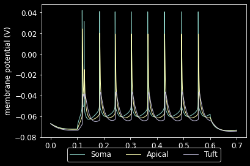

# Conversion to NeuroML

To run this code:
```
nrnivmodl ../NEURON/channels/
python export_nml2.py

```
# After conversion to NeuroML
### Notebook to create multicompartmental cell [here](multicomp_pyr_cell.ipynb)

### After running the multicompartmental cell [LEMS file](LEMS_pyr_multi_comp.xml):
