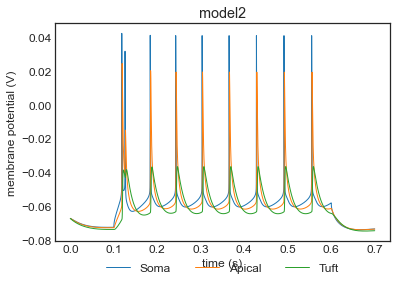
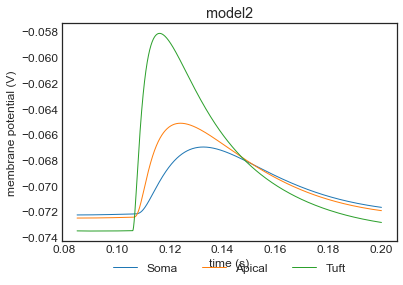
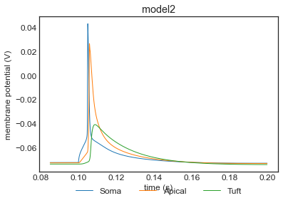
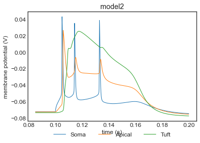

# Conversion to NeuroML

To run this code:
```
nrnivmodl ../NEURON/channels/
python export_nml2.py

```
# After conversion to NeuroML
#### Notebook to create multicompartmental cell [here](multicomp_pyr_cell.ipynb)

#### After running the multicompartmental cell [LEMS file](LEMS_pyr_multi_comp.xml):


### Optimization of the dendritic calcium dynamics and somato-dendritic coupling for varying current injections into the soma and the dendrite
#### Interactive notebook that creates the following plots [here](interactive_nml.ipynb) 
Note: After the parameters are reset run nrnivmodl each time inside this directory to compile the mod files to regenerate the results

##### (b) A small EPSP shaped dendritic current injection does not lead to spiking


##### (c) A somatic current pulse elicits a single somatic spike that back-propagates into the dendrite without crossing the threshold for the initiation of dendritic calcium APs


##### (d) A small dendritic current injection is added the threshold can be crossed and dendritic calcium spikes are elicited and eventually somatic bursting


##### (e) A calcium spike can also be initiated locally in the dendrite when a strong dendritic current injection is used


