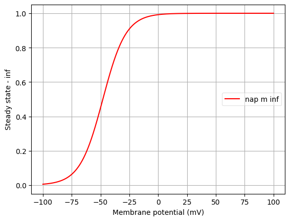
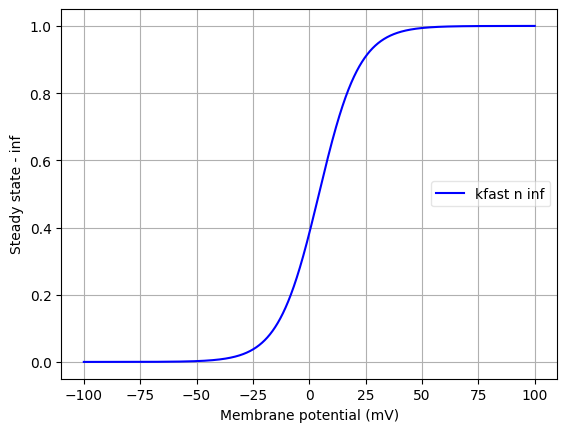
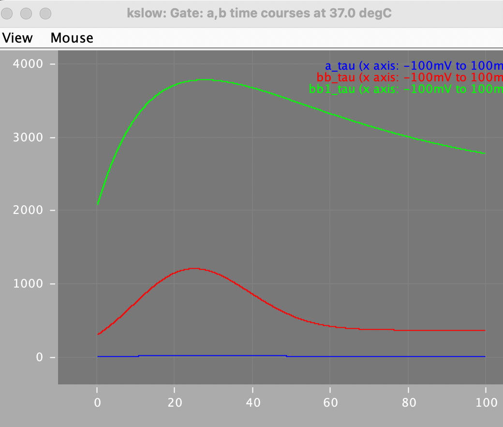
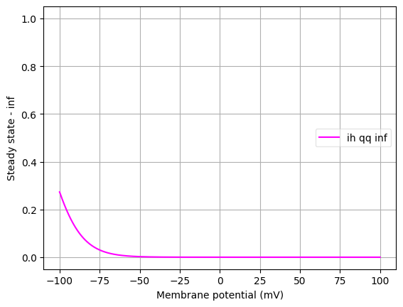
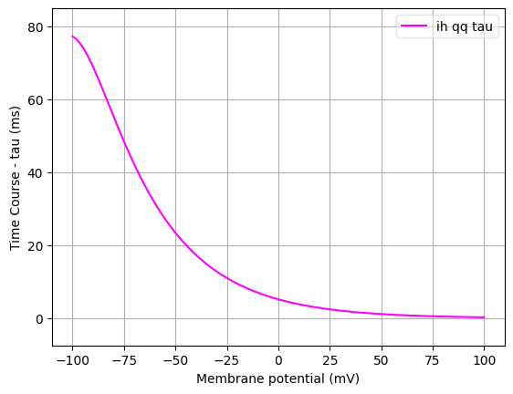

Channel information
===================
    

Channel information at: T = 37.0 degC, E_rev = 0 mV, [Ca2+] = 5e-05 mM

<b>nap</b> 
<a href="../nap.channel.nml">nap.channel.nml</a>
      
        <b>Ion: na</b> 
        <b>
        <i><code>g = gmax * m </code></i> 
        </b>
        

        NeuroML2 file automatically generated from NMODL file: ./NEURON/channels/nap.mod

<b>nat</b> 
<a href="../nat.channel.nml">nat.channel.nml</a>
      
        <b>Ion: na</b> 
        <b>
        <i><code>g = gmax * m3 * h </code></i> 
        </b>
        

        Sodium channel, Hodgkin-Huxley style kinetics.
            Comments from original mod file:
            26 Ago 2002 Modification of original channel to allow variable time step and to correct an initialization
            error.
            Done by Michael Hines(michael.hines@yale.e) and Ruggero Scorcioni(rscorcio@gmu.edu) at EU Advance Course in
            Computational Neuroscience. Obidos, Portugal
            Sodium channel, Hodgkin-Huxley style kinetics.
            Kinetics were fit to data from Huguenard et al. (1988) and Hamill et
            al. (1991)
            qi is not well constrained by the data, since there are no points
            between -80 and -55. So this was fixed at 5 while the thi1,thi2,Rg,Rd
            were optimized using a simplex least square proc.
            Voltage dependencies are shifted approximately from the best
            fit to give higher threshold
            Author: Zach Mainen, Salk Institute, 1994, zach@salk.edu
            May 2006: set the tha -28 mV, vshift 0 and thinf -55 mV to comply with measured
            Somatic Na+ kinetics in neocortex. Kole, ANU, 2006
        

<b>kfast</b> 
<a href="../kfast.channel.nml">kfast.channel.nml</a>
      
        <b>Ion: k</b> 
        <b>
        <i><code>g = gmax * n </code></i> 
        </b>
        

        Potassium channel, Hodgkin-Huxley style kinetics
            Comments from original mod file:
            26 Ago 2002 Modification of original channel to allow variable time step and to correct an initialization error.
            Done by Michael Hines(michael.hines@yale.e) and Ruggero Scorcioni(rscorcio@gmu.edu) at EU Advance Course in Computational Neuroscience. Obidos, Portugal
            Potassium channel, Hodgkin-Huxley style kinetics
            Kinetic rates based roughly on Sah et al. and Hamill et al. (1991)
            Author: Zach Mainen, Salk Institute, 1995, zach@salk.edu
        

<b>km</b> 
<a href="../IKM.channel.nml">IKM.channel.nml</a>
      
        <b>Ion: k</b> 
        <b>
        <i><code>g = gmax * m </code></i> 
        </b>
        

        NeuroML2 file automatically generated from NMODL file: ./NEURON/channels/IKM.mod

<b>km</b> 
<a href="../kslow.channel.nml">kslow.channel.nml</a>
      
        <b>Ion: k</b> 
        <b>
        <i><code>g = gmax * a2 * (0.5*b+0.5*b1)</code></i> 
        </b>
        

        NeuroML2 file automatically generated from NMODL file: ./NEURON/channels/kslow.mod. 
        Example of a fractional gate. Steady state plots for bb and bb1 fractional gates overlap.

<b>ih</b> 
<a href="../ih.channel.nml">ih.channel.nml</a>
      
        <b>Ion: hcn</b> 
        <b>
        <i><code>g = gmax * qq </code></i> 
        </b>
        

        Deterministic model of kinetics and voltage-dependence of Ih-currents
                in layer 5 pyramidal neuron, see Kole et al., 2006. Implemented by
                Stefan Hallermann.

                Added possibility to shift voltage activiation (vshift) and allowed access to gating variables, Armin Bahl 2009

                Predominantly HCN1 / HCN2
        

