Channel information
===================
    

Channel information at: T = 37 degC 

<b>nat</b> 

<a href="nat.inf.png">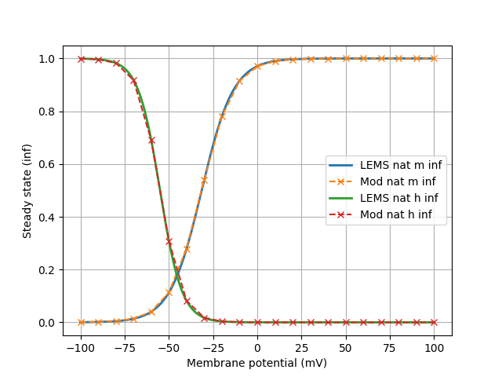</a>
<a href="nat.tau.png">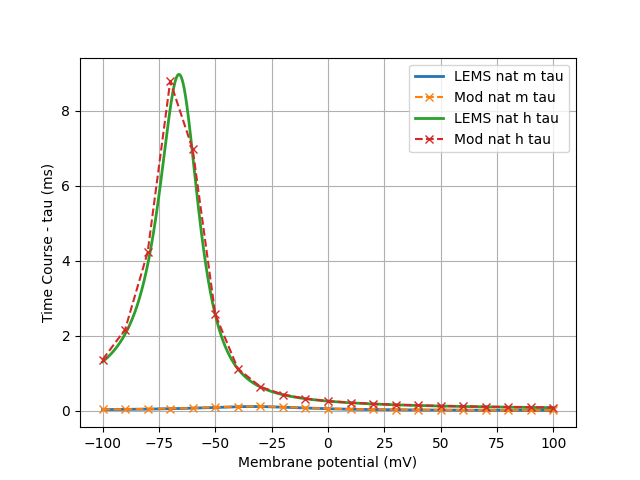</a>

<b>nap</b> 

<a href="nap.inf.png">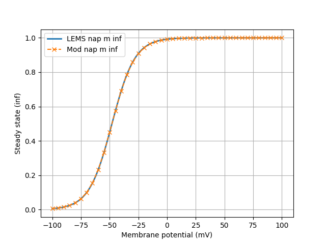</a>
<a href="nap.tau.png">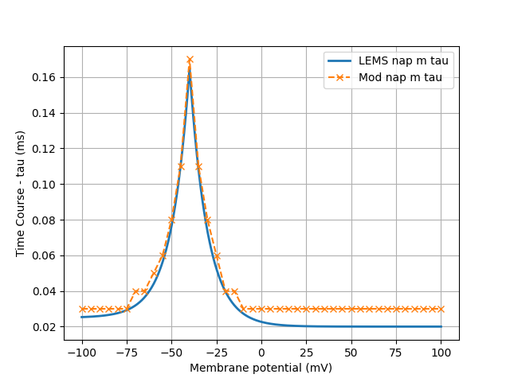</a>

<b>kfast</b> 

<a href="kfast.inf.png">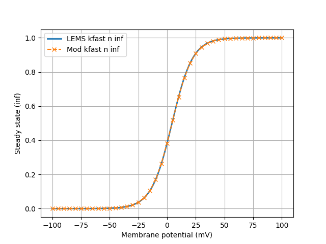</a>
<a href="kfast.tau.png">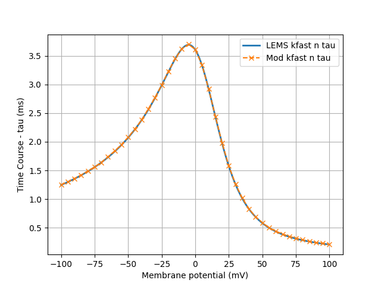</a>

<b>kslow</b> 

<a href="kslow.inf.png">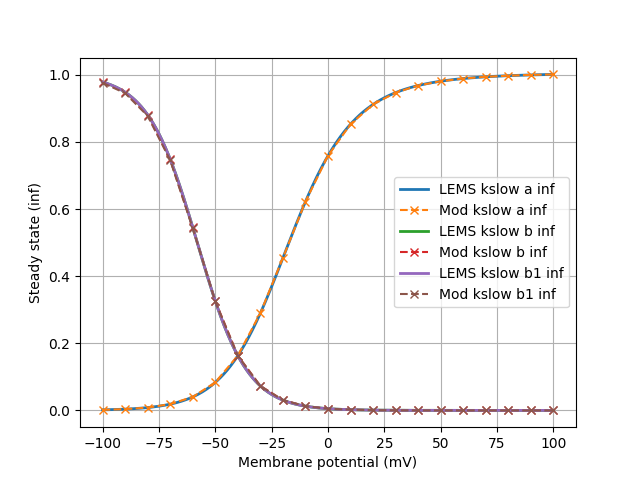</a>
<a href="kslow.tau.png">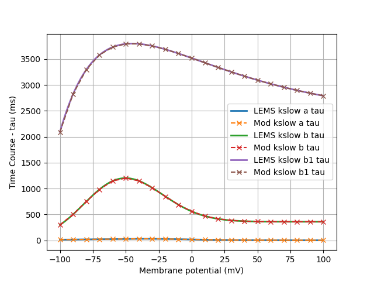</a>

<b>km</b> 

<a href="km.inf.png">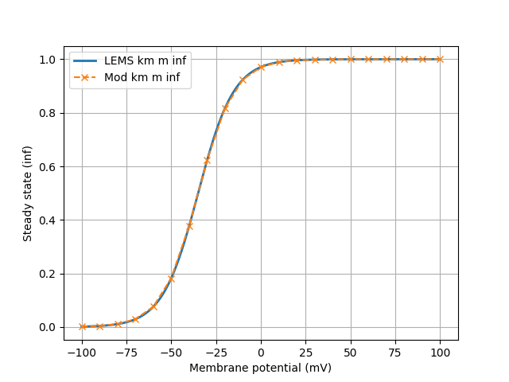</a>
<a href="km.tau.png">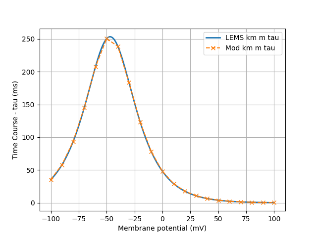</a>

<b>ih</b> 

<a href="ih.inf.png">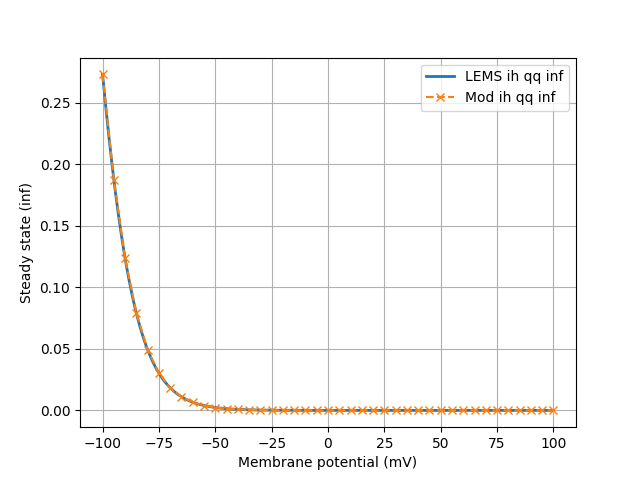</a>
<a href="ih.tau.png">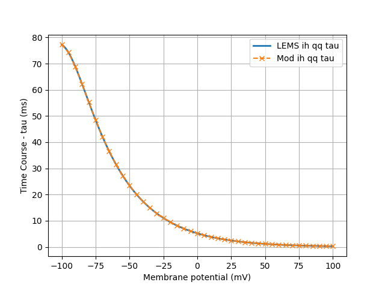</a>

<b>sca</b> 

<a href="sca.inf.png">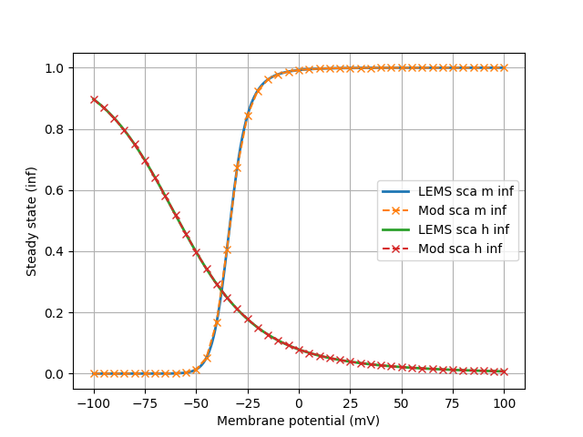</a>
<a href="sca.tau.png">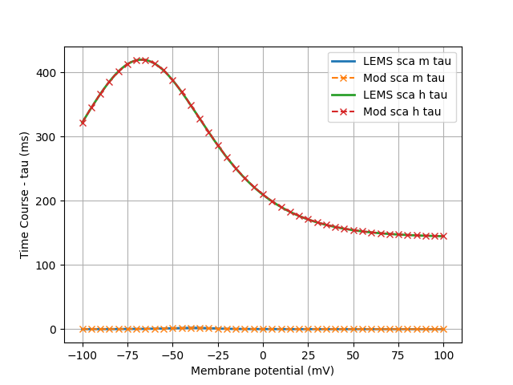</a>

